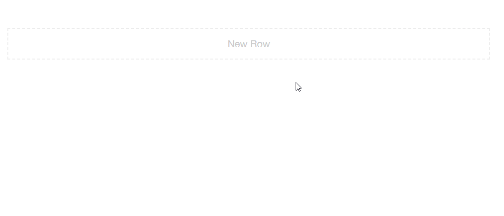

<div align="center">
  <h1>NHS Service Page Builder</h1>
  <p>The NHS Service Page Builder is a frontend tool to quickly create HTML pages.</p>
</div>

<h2 align="center">Prerequisites</h2>

This project relies on

1. NodeJs >= 8.8.1. Download: https://nodejs.org/en/download/
2. php executable >= 7.4. Download: https://www.php.net/downloads.php

<h2 align="center">Install</h2>

To install with a shell script:

Clone the repository, and run
```bash
chmod +x ./install.sh
./install.sh
```

On Windows, it can be installed manually via command prompt:

Clone the repository, then run `npm install` both in the backend and frontend folders.
```dos
cd backend/
npm install
cd ../frontend/
npm install
```

<h2 align="center">Get Started</h2>

```bash
chmod +x ./start.sh
./start.sh
```

On Windows, it can be started manually via command prompt:

```dos
cd ./backend
md ..\tmp
START /B node ./node_modules/webpack/bin/webpack.js -w > ../tmp/tmp.txt
START /B node server.js > ../tmp/tmp2.txt
cd ../frontend
START /B node build/dev-server.js > ../tmp/tmp3.txt

```

Close the terminal/command prompt can stop serving and release ports. Or, run

```bash
chmod +x ./stop.sh
./stop.sh
```

<h2 align="center">Concepts</h2>

The builder allows 3 types of elements to be created: Row, Column and Block. The builder is a WYSIWYG environment (What You See Is What You Get).




<h2 align="center">Export the page and deploy</h2>

Once a page is built, one can use the 'Export' button to get the full HTML code for the page.

When deploying the exported page to a server, the external static assets must be hosted on the server.

To achieve this replace the `http://localhost:3000/` with `backend/lib/generator.class.php`, with the target server address, for example, `http://example.com`.

Make sure the external linked static assets are available on the target server. For example, the folder available at `http://localhost:3000/css/fonts` must be uploaded to `http://example.com/css/fonts`.

Then, restart the project and import/export again.

<h2 align="center">Import</h2>

The exported html contains importable scripts.

To import:
1. Click on import button
2. Copy and paste the previously exported html.

<h2 align="center">Contributors</h2>

KD Web is a full service web design agency based in London. We craft beautiful, engaging websites and deliver successful SEO campaigns.

Developer: Ruichao Wang

Designer: Simeon Artamonov
